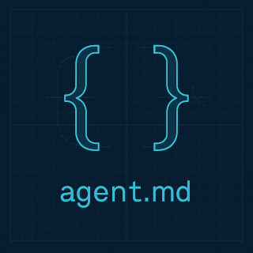

[](https://twitter.com/deanthecoder)

<p align="center">
  
</p>

# AgentPrimer  
### A quick way to teach AI tools how your codebase works

AgentPrimer scans a repository and builds a smart snapshot of its structure, dependencies, and coding style.  
It’s like handing an AI assistant a crash course in your project before it ever writes a line of code.

---

## What It Does

- Summarizes repo structure, file paths, and linked GitHub remotes.  
- Reports language mix, package dependencies, and framework usage.  
- Highlights project layout, test frameworks, and authoring conventions.
- Detects localized resources to highlight supported UI languages.

---

## What’s `agents.md`?

`agents.md` is a machine-readable guide that gives coding AIs project-specific context — dependencies, test setup, build flow, and conventions.  
[Learn more →](https://agentsmd.net/#what-is-agentsmd)

---

## Usage

Run AgentPrimer from the root of the repo you want to analyze:

```bash
dotnet run --project AgentPrimer
```

You’ll get output like this:

```
Repositories (3)
  * https://github.com/deanthecoder/AgentPrimer  
    Efficiently auto-generate AI agent instructions for your coding project.
  * https://github.com/deanthecoder/DTC.Core (Submodule)  
    Core C# library (used by many deanthecoder repos)
  * https://github.com/deanthecoder/DTC.Installer (Submodule)  
    Cross platform script for packaging applications.
  
Stats
  * Files      : 104
  * Languages  : C# (99%)
  * English    : American English
  
Supported UI Languages (4)
  * English (US)
  * English (GB)
  * Chinese (Simplified)
  * Japanese
  
Largest Source Files (8)
  * 19.51 KB     : Installer/pack.py
  * 17.38 KB     : DTC.Core/DTC.Core/UI/ShaderControl.cs
  * 15.63 KB     : DTC.Core/DTC.Core/Extensions/FastLinq.cs
  * 14.68 KB     : DTC.Core/DTC.Core/Markdown/ConsoleRenderer.cs
  * 11.07 KB     : AgentPrimer/Utilities/ProjectPreferencesAnalyzer.cs
  * 10.81 KB     : DTC.Core/DTC.Core/Extensions/DirectoryInfoExtensions.cs
  * 8.59 KB      : AgentPrimer/Utilities/GitRepositoryInspector.cs
  * 8.44 KB      : AgentPrimer/ConsoleReportOutput.cs
  
NuGet (11)
  Avalonia | DialogHost.Avalonia | DotnetNoise | JetBrains.Annotations
  K4os.Compression.LZ4 | Markdig | Material.Avalonia
  Material.Icons.Avalonia | Newtonsoft.Json | OpenCvSharp4 | SkiaSharp

Preferences
  * Nullable : disabled
  * Tests    : Unknown
  * Mocking  : Unknown
  * UI       : Avalonia
  
Projects
  Top-level
    * AgentPrimer.csproj (net9.0)
  
  Internal
    * DTC.Core.csproj (net8.0) [refs:1]
  
READMEs (3)
  * DTC.Core/README.md
  * Installer/README.md
  * README.md
```

---

## Why Use It?

AgentPrimer gives AI tools the same understanding of your repo that a human would gain from a deep dive — instantly.  
It’s fast, consistent, and ensures every generated `agents.md` starts from solid, accurate insight.

---

## Goals

- Deliver an accurate, repeatable repo overview.  
- Capture the key details needed to generate `agents.md`.  
- Reveal structure, dependencies, and testing conventions clearly.  
- Help AI agents slot into your workflow with minimal setup.

---

## License

MIT License. See [LICENSE](LICENSE) for details.
