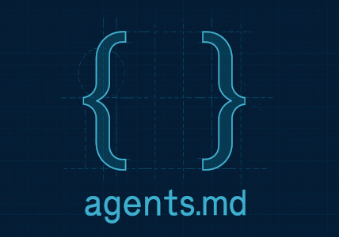

[](https://twitter.com/deanthecoder)

<p align="center">
  
</p>

# AgentPrimer  
### A quick way to teach AI tools how your codebase works

AgentPrimer scans a repository and builds a smart snapshot of its structure, dependencies, and coding style.  
It’s like handing an AI assistant a crash course in your project before it ever writes a line of code.

---

## What It Does

- Summarizes repo structure, file paths, and linked GitHub remotes.  
- Reports language mix, package dependencies, and framework usage.  
- Highlights project layout, test frameworks, and authoring conventions.

---

## What’s `agent.md`?

`agent.md` is a machine-readable guide that gives coding AIs project-specific context — dependencies, test setup, build flow, and conventions.  
[Learn more →](https://agentsmd.net/#what-is-agentsmd)

---

## Usage

Run AgentPrimer from the root of the repo you want to analyze:

```bash
dotnet run --project AgentPrimer
```

You’ll get output like this:

```
Path:
  /Users/dean/Documents/Source/Repos/Tetra

GitHub (2):
  - https://github.com/deanthecoder/Tetra : Cross platform virtual machine with native vector support
  - https://github.com/deanthecoder/DTC.Core : Core C# library (used by many deanthecoder repos)

Stats:
  Files      : 177
  Languages  : C# (99%) | C/C++ (1%)
  English    : American English

NuGet (15):
  Avalonia | coverlet.collector | DialogHost.Avalonia
  DotnetNoise | JetBrains.Annotations | K4os.Compression.LZ4
  Material.Avalonia | Material.Icons.Avalonia
  Microsoft.NET.Test.Sdk | Newtonsoft.Json | NUnit
  NUnit3TestAdapter | OpenCvSharp4 | SkiaSharp | TextCopy

Preferences:
  Nullable   : disabled (most)
  Tests      : NUnit
  Mocking    : Unknown
  UI         : Avalonia

Projects:
  Top-level  : TetraShade.csproj (net9.0), UnitTests.csproj (net9.0)
  Internal   : DTC.Core.csproj (net8.0) [refs:5]
               TetraCore.csproj (net9.0) [refs:3]
               DTC.GLSLLexer.csproj (net9.0) [refs:2]
               DTC.GLSLParser.csproj (net9.0) [refs:1]
               DTC.Preprocessor.csproj (net9.0) [refs:1]

READMEs:
  README.md
  DTC.Core/README.md
  DTC.GLSLLexer/README.md
  DTC.GLSLParser/README.md
```

---

## Why Use It?

AgentPrimer gives AI tools the same understanding of your repo that a human would gain from a deep dive — instantly.  
It’s fast, consistent, and ensures every generated `agent.md` starts from solid, accurate insight.

---

## Goals

- Deliver an accurate, repeatable repo overview.  
- Capture the key details needed to generate `agent.md`.  
- Reveal structure, dependencies, and testing conventions clearly.  
- Help AI agents slot into your workflow with minimal setup.

---

## License

MIT License. See [LICENSE](LICENSE) for details.
